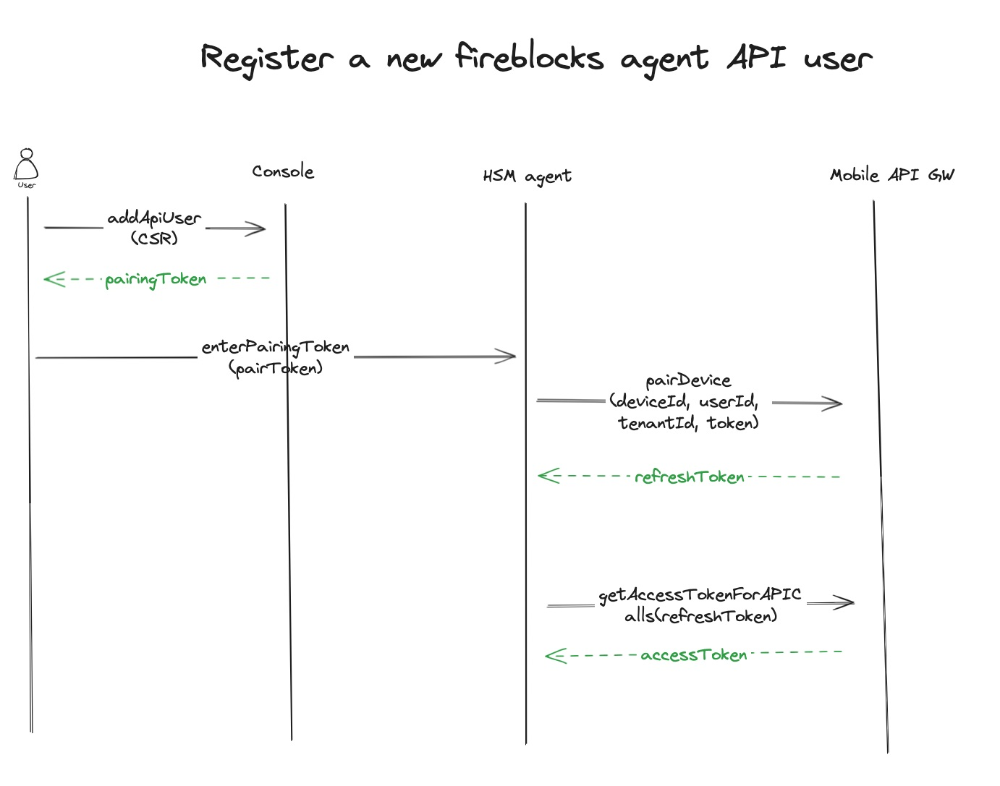
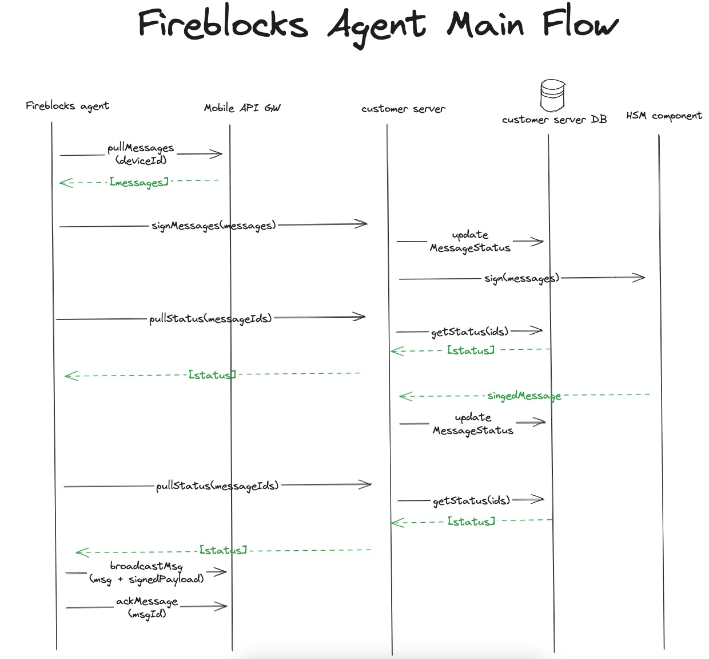

# Welcome to Fireblocks Agent

# Develop (Run Locally)

### Preconditions

- Make sure you have nvm on your machine. To check, run `nvm` in a terminal.
  - To install `nvm`:
    - On mac run `brew install nvm`
    - Linux, follow these [instructions](https://github.com/nvm-sh/nvm?tab=readme-ov-file#installing-and-updating)

### Installation 

- `git clone https://github.com/fireblocks/fireblocks-agent.git`
- `cd fireblocks-agent`
- `nvm use`
- install dependencies `npm i`

### Running
- Build and run example customer server docker `npm run start:example-server`
- Copy `.env.prod` and name it `.env.{env}` for example `.env.dev9`
- Edit your newly created `.env.{env}` file with the right config
- Start fireblocks agent with your desired env i.e `npm run start --env=dev9`

### fireblocks agent environment parameters
The fireblocks agent expect a configuration file (for production it's called `.env.prod`) with several parameters:
* `MOBILE_GATEWAY_URL` - In production this value should be `https://mobile-api.fireblocks.io`
* `CUSTOMER_SERVER_URL` - The client's custom server url
* `CUSTOMER_SERVER_PULL_CADENCE` - Cadence of pulling messages status
* `CUSTOMER_SERVER_AUTHORIZATION` - If exists, the fireblocks agent will send its value on the `Authorization` header for each request. The client can use it for authorizing the fireblocks agent or keep track on which agent is calling it

# Fireblocks External Keys Workspace

### Actors
The Fireblocks external keys workspace consists of several components (aka actors). Each with its own responsibility.

* Console - Fireblocks web console. [Link](https://console.fireblocks.io/v2/)
* Mobile App - Fireblocks mobile app.
* Mobile API Gateway - Fireblocks's REST API Server. The firblocks agent communicates with this server in the registration flow and for receiving new messages.
* Developer API - Fireblock's back office server for workspace setup and configuration.
* Fireblocks agent - An on-prem service written in Typescript which is responsible for receiving new messages to sign from Fireblocks, relay these messages to the client's HSM and return the signed result back to Fireblocks.
* Customer Server - The client's own server which receives messages to sign from the fireblocks agent. Sign them via the client's HSM and provide the fireblocks agent with the signed messages.
* HSM component - The actual HSM implementation. Can be on prem or a cloud based HSM.

## Fireblocks Agent Main Flows

#### Register a new fireblocks agent API user

#### Fireblocks agent main logic

#### Add validator key
This procedure should happen once. Fireblocks will need a validator key to approve new signing keys. This flow is done via the fireblocks sdk and not via this program.

## Customer Server
The customer server is a component that should be written by the client according to the client's connection to the HSM component. The server is expected to implement the following [OpenAPI spec](api/customer-server.api.yml).

In general, it should support signing messages according to `ECDSA` and `EDDSA` algorithms and return the status for given messages.

We provide an example of such a server with a software implementation of HSM called [softHSM](https://www.opendnssec.org/softhsm/)

The entry point for the server is [here](examples/server/src/server.ts)

## Customer Server Flows

#### Sign messages

#### Pull messages status

