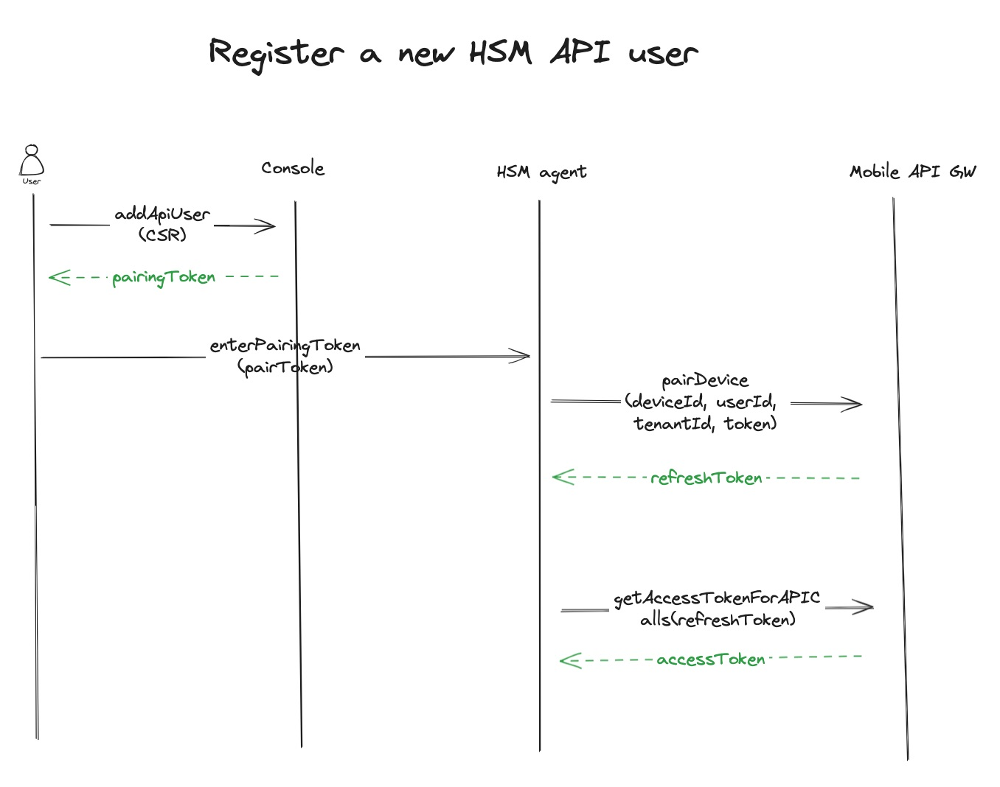
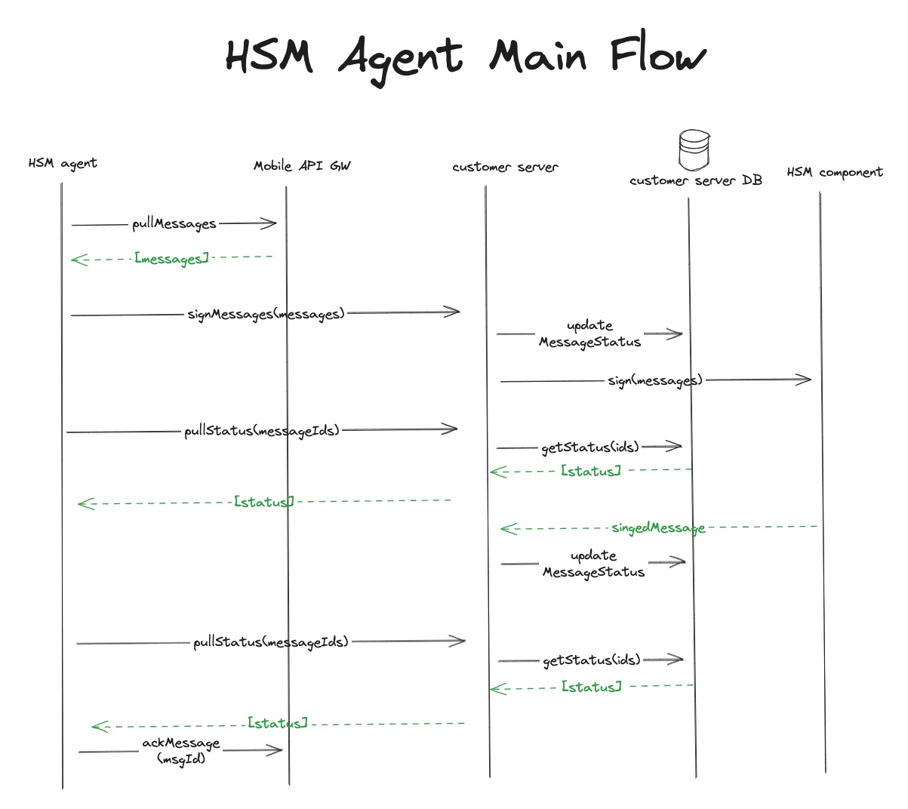
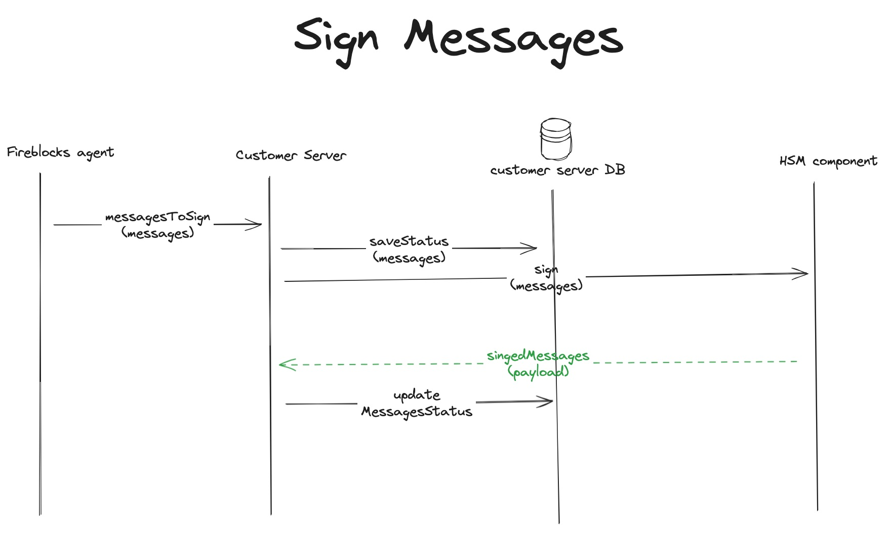

# 🚀 Welcome to Fireblocks HSM Agent

# Develop (Run Locally)

### Preconditions

- Make sure you have nvm on your machine. To check, run `nvm` in a terminal.
  - To install `nvm`:
    - On mac run `brew isntall nvm`
    - Linux, follow these [instructions](https://github.com/nvm-sh/nvm?tab=readme-ov-file#installing-and-updating)

### Installation 

- `git clone git@gitlab.com:fireblocks/shell/common/hsm-agent.git`
- `cd hsm-agent`
- `nvm use`
- install dependencies `npm i`

### Running
- Build and run example customer server docker `npm run start:example-server`
- Copy `.env.prod` and name it `.env.{env}` for example `.env.dev9`
- Edit your newly created `.env.{env}` file with the right config
- Start hsm agent with your desired env i.e `npm run start --env=dev9`

# Fireblocks External Keys Workspace

### Actors
The fireblocks extenral keys worksapce consists of several components (aka actors). Each with its own responsibility.

* Console - Fireblocks web console. [Link](https://console.fireblocks.io/v2/)
* Mobile App - Fireblocks mobile app.
* Mobile API Gateway - Fireblocks's REST API Server. The HSM-Agent communicate with this server in the registration flow and for receiving new messages.
* Developer API - Fireblock's back office server for workspace setup and configuration.
* HSM-Agent - An on-prem service written in Typescript which is responsible for receiving new messages to sign from fireblocks, relay these messages to the clien't HSM and return the signed result back to Fireblocks.
* Customer Server - The client's own server which receive messages to sign from the HSM-Agent. Sign them via the client's HSM and provide the HSM-Agent with the signed messages.
* HSM component - The actual HSM implementation. Can be on prem or a cloud based HSM.

## HSM API User Main Flows

#### Register a new HSM API user

#### HSM API user main logic

#### Add validator key
This procedure shuold happen once. Fireblocks will need a validator key to approve new signing keys. This flow is done via the fireblocks sdk and not via this program.

## Customer Server
The customer server is a component that should be written by the client according to the client's connection to the HSM component. The server is expected to implement the following [OpenAPI spec](api/customer-server.api.yml).

In general, it should support signing messages according to `ECDSA` and `EDDSA` algorithms and return the status for given messages.

We provided an exmaple of such a server with a software implementation of HSM called [softHSM](https://www.opendnssec.org/softhsm/)

The entry point for the server is [here](examples/server/src/server.ts)

## Customer Server Flows

#### Sign messages

#### Pull messages status

