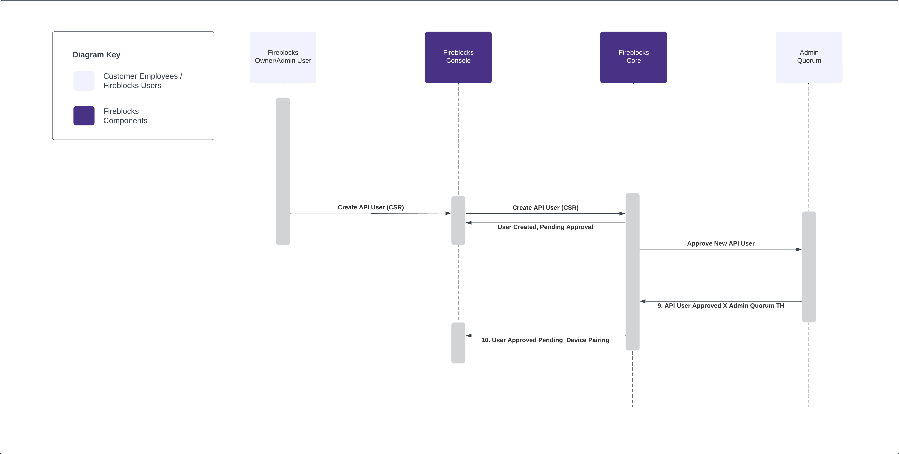
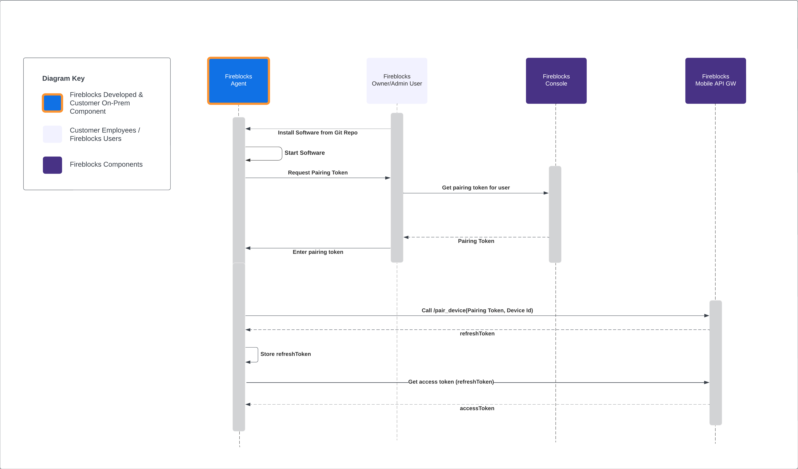
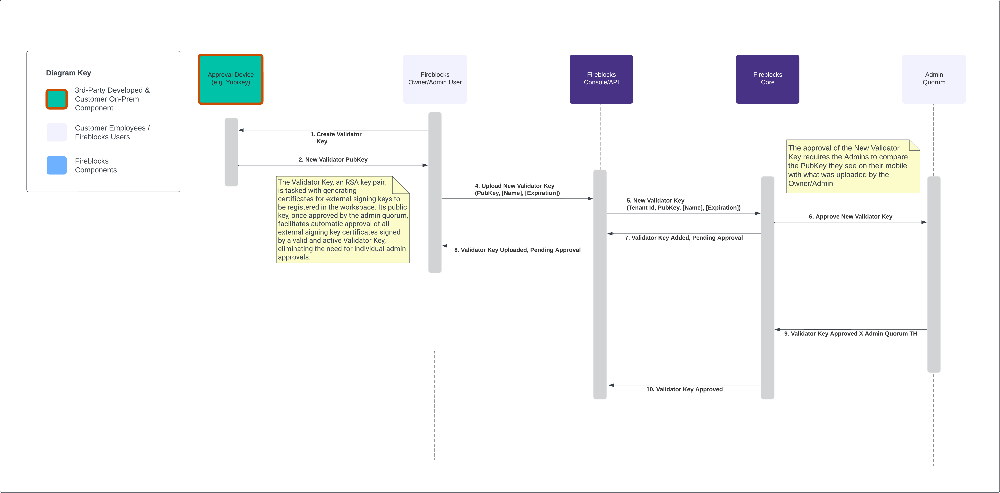
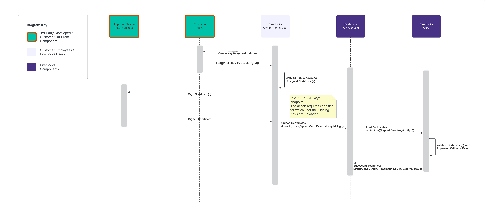
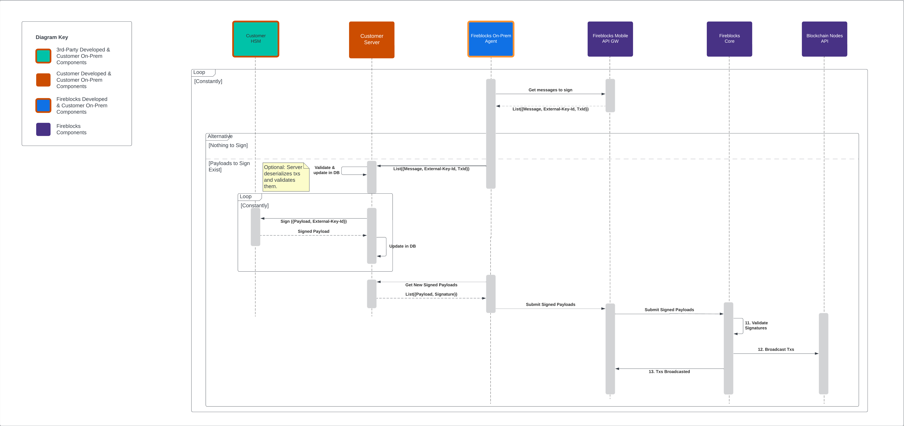

# Welcome to Fireblocks Agent

Fireblocks Agent is an open-source on-prem service written in Typescript which is responsible for receiving new messages to sign from Fireblocks, relay these messages to the client's HSM and return the signed result back to Fireblocks.

# Develop (Run Locally)

### Prerequisites

- Make sure you have nvm on your machine. To check, run `nvm` in a terminal.
  - To install `nvm`:
    - On mac run `brew install nvm`
    - Linux, follow these [instructions](https://github.com/nvm-sh/nvm?tab=readme-ov-file#installing-and-updating)

### Installation 

- `git clone https://github.com/fireblocks/fireblocks-agent.git`
- `cd fireblocks-agent`
- `nvm use`
- install dependencies `npm i`

### Running
- Build and run example customer server docker:
  - `cd examples/server`
  - `npm run build:docker`
  - `npm run start:docker`
  - Optional: to scale signing across CPU cores, run the example server in [cluster mode](examples/server/README.md#running-in-cluster-mode-optional) instead

- Configure and run Fireblocks agent:
- Copy `.env.prod` and name it `.env.{env-name}` (e.g. `.env.test`)
- Edit your newly created `.env.{env-name}` file with the right configuration
- Build the Fireblocks agent:
  - `npm run build`
- Start the Fireblocks agent with your desired environment:
  - `npm run start --env=env-name`

### Fireblocks Agent Environment Variables
The Fireblocks agent expect a configuration file (for production it's called `.env.prod`) with several parameters:
* `MOBILE_GATEWAY_URL` - In production this value should be `https://mobile-api.fireblocks.io`
* `CUSTOMER_SERVER_URL` - The client's custom server url
* `CUSTOMER_SERVER_PULL_CADENCE_MS` - Cadence of pulling messages status
* `CUSTOMER_SERVER_AUTHORIZATION` - If exists, the Fireblocks agent will send its value on the `Authorization` header for each request. The client can use it for authorizing the fireblocks agent or keep track on which agent is calling it
* `SSL_CERT_PATH` - If exists, a path to a self-signed SSL certificate which will be used to validate the server certificate
* `WEBSOCKET_ENABLED` - Message-delivery transport. When enabled (the default, including when the variable is unset) the agent receives messages from Fireblocks over a **high-performance WebSocket push stream** from the Mobile API Gateway — this is the recommended mode for a strong or horizontally-scaled ("clustered") customer server that can sign many requests in parallel. To fall back to the conservative HTTP long-polling behaviour (better suited to a single-process / lower-throughput customer server), set it to any of `false`, `0`, `no`, or `off` (case-insensitive, surrounding whitespace ignored). Any other value — including blank or unrecognised — keeps WebSocket delivery **on**, so the kill-switch never fails open.
* `WS_PING_INTERVAL_MS` - WebSocket client-side keep-alive ping cadence in milliseconds (default `30000`). If no pong or traffic arrives within one interval the socket is treated as half-dead and reconnected. Only relevant when `WEBSOCKET_ENABLED` is not `false`.

# About the Fireblocks Key Link Workspace

## Actors
The Fireblocks Key Link workspace consists of several components (aka actors). Each with its own responsibilities.

* Console - Fireblocks web console. [Link](https://console.fireblocks.io/v2/)
* Mobile App - Fireblocks mobile app.
* Mobile API Gateway - Fireblocks REST API Server. The Fireblocks agent communicates with this server in the registration flow and for receiving new messages.
* Developer API - Fireblocks back office server for workspace setup and configuration.
* Fireblocks Agent - An on-prem service written in Typescript which is responsible for receiving new messages to sign from Fireblocks, relay these messages to the client's HSM and return the signed result back to Fireblocks.
* Customer Server - The client's own server which receives messages to sign from the Fireblocks agent. Sign them via the client's HSM and provide the Fireblocks agent with the signed messages.
* HSM component - The actual HSM implementation. Can be on prem or a cloud based HSM, or a different Key Management System.

## About the Customer Server
The customer server is a component that should be written by the client according to the client's connection to the HSM component. The server is expected to implement the following [OpenAPI spec](api/customer-server.api.yml). 

In general, it should support signing messages according to `ECDSA` and `EdDSA` algorithms and return the status for given messages.

We provide an example of such a server in `examples/server` with an integration to a software implementation of an HSM called [softHSM](https://www.opendnssec.org/softhsm/)

The entry point for the server can be found [here](examples/server/src/server.ts)

## Main Flows

### Create a New Fireblocks Agent API User

### Pair the Fireblocks Agent Device

### Add a Validator Key
This procedure should happen once. Fireblocks will need a validator key to approve new signing keys. This flow is done via the Fireblocks sdk and not via this program.

### Add Signing Keys
Each signing key should be first converted into a certificate which should be signed by an active validator key. The signed certificates are then regsitered to Fireblocks via the API or the Console. 

### Fireblocks Agent & Customer Server with HSM - Main Flow

> **Message delivery (WebSocket by default):** By default the agent receives messages from Fireblocks over a WebSocket push stream (Mobile API Gateway, path `/msg/ws`) instead of HTTP long-polling. Acknowledgements are sent back over the same socket, and tx-sign responses ride the socket too (see the transport note below); proof-of-ownership responses stay on HTTP. Push delivery removes the throughput ceiling of the long-polling model. To revert to HTTP long-polling, set `WEBSOCKET_ENABLED=false`. The diagrams above depict the HTTP long-poll message-retrieval flow; under the WebSocket default, message retrieval is push-based rather than polled while the rest of the flow (signing and broadcasting responses) is unchanged.

> **Response transport (only tx-sign goes over the WebSocket):** Of the two response types, only `KEY_LINK_TX_SIGN_RESPONSE` is broadcast over the socket (falling back to HTTP whenever the socket is not connected). MAG's WS branch routes every framed broadcast to `broadcastMsg` — the same downstream as the HTTP `keylink_tx_sign_response` route — so sending tx-sign over the socket is equivalent. `KEY_LINK_PROOF_OF_OWNERSHIP_RESPONSE` always stays on HTTP: its HTTP route dispatches to a different downstream (`zServiceMessageSender`) that MAG's broadcastMsg-only WS branch cannot reach, so sending it over the socket would mis-route it.

> **High-performance mode & at-least-once delivery:** The WebSocket transport is the high-performance version of the agent — it is built for a strong or clustered customer server that signs requests in parallel, whereas HTTP long-polling is the conservative default for a single-process / lower-throughput customer server. Because the agent forwards pushed requests concurrently and delivery is **at-least-once**, the same request (identified by its `requestId`) may be delivered more than once — for example, when the Mobile API Gateway redelivers after a reconnect. **The customer server MUST cache/dedupe by `requestId` and treat a repeated `requestId` as idempotent**, returning the previously computed result instead of signing again. The agent deliberately stays simple (forward + at-least-once) and relies on the customer server as the idempotency boundary; this assumption is what makes the high-performance path safe.